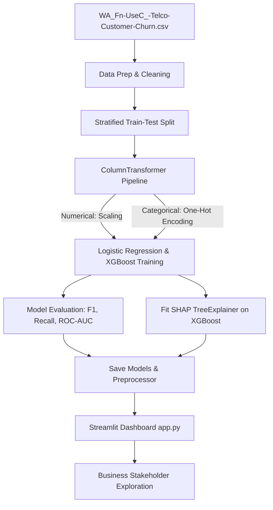

# Telco Customer Churn Intelligence & Business Retention Deck

An enterprise-grade, end-to-end Machine Learning pipeline and interactive Streamlit dashboard that predicts telecom customer churn, explains individual customer risk drivers using SHAP (Explainable AI), and translates model scores into commercial business recommendations (Revenue Saved, Campaign Costs, and Net Campaign ROI).

---

## 💼 Business Context & Challenge

In the telecom industry, customer acquisition costs (CAC) are significantly higher than customer retention costs. Retaining a customer who is likely to cancel (churn) is a high-priority business initiative. 

Historically, churn models simply output a "probability score" (e.g. *Customer X has 78% risk*). However, business stakeholders cannot easily translate that probability into financial decisions:
1. **How much revenue is actually at risk?**
2. **What risk threshold should we target to maximize retention campaign ROI?**
3. **What incentives (discounts, contracts, support services) should we offer to specific customers to effectively reduce their risk?**

This project answers these questions by combining **state-of-the-art predictive modeling (XGBoost)** with **Explainable AI (SHAP)** and an **interactive ROI Campaign Simulator**.

---

## 🛠️ Tech Stack & Architecture

- **Core Analytics & EDA**: Python, Pandas, NumPy
- **Machine Learning**: Scikit-Learn (Logistic Regression, ColumnTransformer), XGBoost
- **Explainable AI**: SHAP (SHapley Additive exPlanations)
- **Interactive UI**: Streamlit, Plotly, HTML/CSS Custom Styling
- **Deployment**: Streamlit Community Cloud

### Machine Learning Pipeline Diagram


---

## 📊 Modeling Results & Comparison

We evaluated a baseline **Logistic Regression** model against a challenger **XGBoost** model. Since churn is imbalanced (~26.5% of the data), we focused on **Recall** (capturing the maximum number of true churners) and **F1-Score** (avoiding wasteful false-alarm retention spending).

| Model | Churn Recall | Churn Precision | Churn F1-Score | ROC-AUC | PR-AUC |
| :--- | :---: | :---: | :---: | :---: | :---: |
| **Logistic Regression (Baseline)** | **78.1%** | 50.1% | 61.1% | 0.8415 | 0.6318 |
| **XGBoost (Challenger)** | 77.3% | **51.8%** | **62.0%** | **0.8414** | **0.6558** |

*Note: Models were optimized using class-weight parameters (`class_weight='balanced'` in Logistic Regression and `scale_pos_weight` in XGBoost) to handle class imbalance without synthetic data leakage.*

---

## 💰 Business Translation & ROI Formula

To justify a retention marketing budget, the model probabilities are converted into simulated campaign financial impact metrics:

1. **Baseline Revenue Loss ($/mo)**: Total monthly revenue lost if no retention campaign is executed.
   $$Loss_{baseline} = \sum_{i \in \text{Actual Churners}} \text{Monthly Charges}_i$$
2. **Gross Recovered Churn Revenue**: The revenue saved from targeted churners who accept the offer.
   $$Revenue_{recovered} = \text{Success Rate} \times \sum_{i \in \text{Targeted Churners}} \text{Monthly Charges}_i$$
3. **Monthly Campaign Cost**: Cost of offering the loyalty discount (assumed to be accepted by all targeted false alarms and a portion of true positives).
   $$Cost_{campaign} = \text{Offer Value} \times (N_{\text{False Positives}} + \text{Success Rate} \times N_{\text{True Positives}})$$
4. **Net Monthly Savings**: 
   $$Savings_{net} = Revenue_{recovered} - Cost_{campaign}$$
5. **Campaign ROI (%)**: 
   $$ROI = \frac{Savings_{net}}{Cost_{campaign}} \times 100\%$$

The dashboard calculates these equations across all potential risk thresholds to determine the **Optimal Target Percentile** that maximizes Net Savings.

---

## 🎮 Dashboard Features

### 1. Executive Dashboard & ROI Simulator
- **Interactive Controls**: Stakeholders adjust Offer Value ($), Success Rate (%), and Churn Risk Threshold.
- **ROI Optimization Curve**: Chart displaying Net Savings vs. % targeted. It places a red indicator on the exact percentile that yields maximum profit.
- **Auto-generated prescriptions**: Recommends the exact targeting guidelines for the marketing department.

### 2. Customer Segment Explorer
- Filter the entire customer database by Contract Type, Internet Service Type, Tech Support Enrollment, Payment Method, Tenure, and Monthly Charges.
- Instantly view segment stats: segment size, average risk score, and monthly revenue-at-risk.
- **Target Roster Download**: Generate and download a CSV table of the top 25 highest-risk customers within the filtered segment for direct retention campaigns.

### 3. Individual Customer Drill-Down & What-If Sandbox
- **Individual Lookup**: Search by Customer ID or choose from pre-sorted High, Medium, and Low-risk dropdown examples.
- **SHAP Risk Drivers**: Plotly horizontal bar chart displaying features that pull risk up (red) or push it down (cyan). 
- **What-If Sandbox**: Live control panel where users modify account configurations (e.g. change Contract to 'Two year', enroll in 'Tech Support', apply a '$15 loyalty discount') and watch the churn risk score recalculate in real-time.
- **Actionable Prescription**: Automatically drafts the optimal retention recipe (e.g., *"Successfully mitigated churn risk by offering a loyalty discount of $10.00/mo and transitioning the customer to a One year contract."*).

---

## 🚀 Running the Project Locally

### 1. Clone & Setup Workspace
Ensure you have Python 3.9+ installed. Naviate to the project directory:
```bash
# Clone the repository
git clone <your-repo-link>
cd telco-churn-prediction
```

### 2. Install Dependencies
```bash
pip install -r requirements.txt
```

### 3. Execute the Machine Learning Pipeline
This generates statistical summaries and trains/saves the ML models:
```bash
# 1. Run exploratory data analysis and save insights JSON
python src/eda_insights.py

# 2. Preprocess data, train ML models, fit SHAP, and save binaries
python src/train.py
```

### 4. Launch the Streamlit App
```bash
streamlit run app.py
```
Open your browser and navigate to `http://localhost:8501`.

---

## ☁️ Deployment (Streamlit Community Cloud)

This app is structured for simple and free deployment on the Streamlit Community Cloud:

1. **Push to GitHub**: Commit all repository files (including the trained `.pkl` assets in `models/` so the app doesn't have to retrain on startup) and push to GitHub.
2. **Deploy on Streamlit**:
   - Go to [share.streamlit.io](https://share.streamlit.io) and log in.
   - Click **New app**, select your repository, branch, and set the Main file path to `app.py`.
   - Click **Deploy!** 
3. **Share Your Link**: Include the live app link directly at the top of your resume and GitHub repository!
